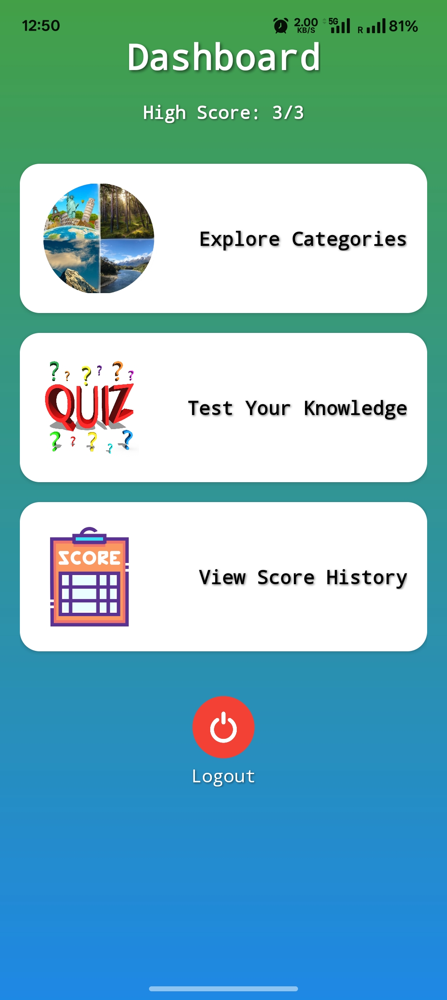
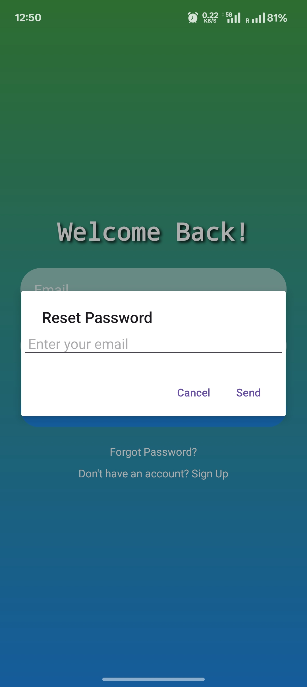

# 🌍 Geography Explorer

An interactive Android application built with Kotlin that helps users learn about geographical features using satellite imagery, maps, and an integrated quiz system.

## Features

- 🔐 **Secure Authentication:** Full user sign-up and login system using Firebase Authentication.
- 🗺️ **Interactive Maps:** Explores geographical categories with dynamic Google Maps integration, featuring satellite/hybrid views, location search, and seamless panning.
- 🧠 **Engaging Quizzes:** A multiple-choice quiz system to test user knowledge.
- 💾 **Persistent Data:** User quiz scores are saved locally using Room Database, displaying the all-time high score on the dashboard.
- 📜 **Score History:** View the last 10 quiz results with timestamps, with a mechanism to reset history after 10 entries.
- 📱 **Modern UI:** Clean, responsive user interface built with modern Android components.

## Screenshots

| Onboarding Flow | Main Dashboard |
| :---: | :---: |
|  |  |
| **Splash Screen** | **Dashboard** |
|  |  |
| **Login Screen** | **Category List** |
|  |  |
| **Sign Up Screen** | **Interactive Map** |

| Quiz & Results |
| :---: |
|  |
| **Quiz in Progress** |
|  |
| **Final Score Screen** |
|  |
| **Forgot Password Dialog** |