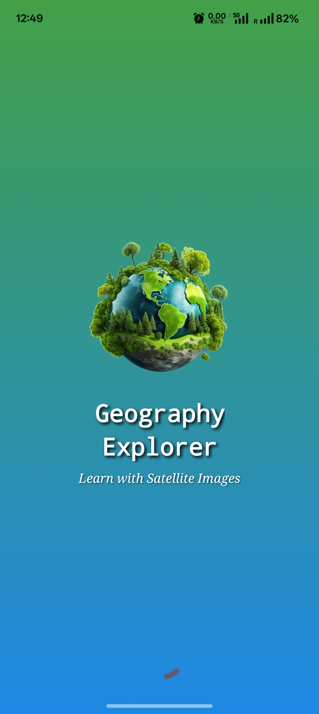
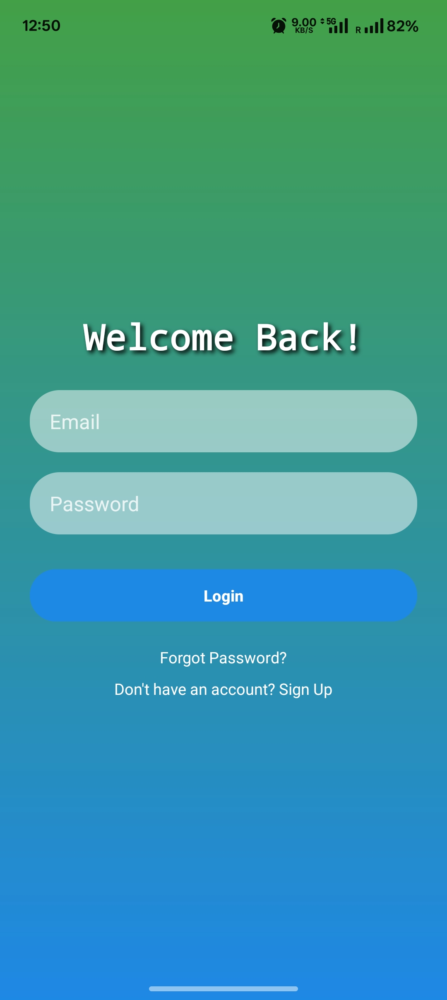
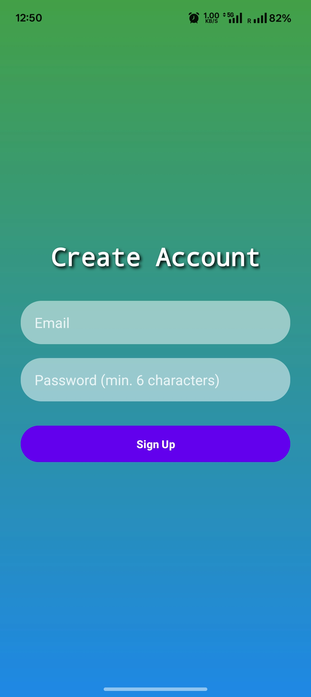
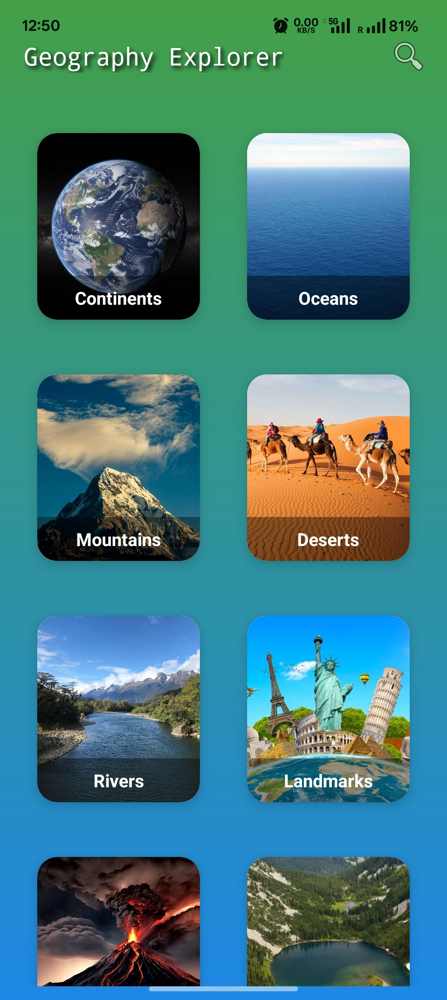
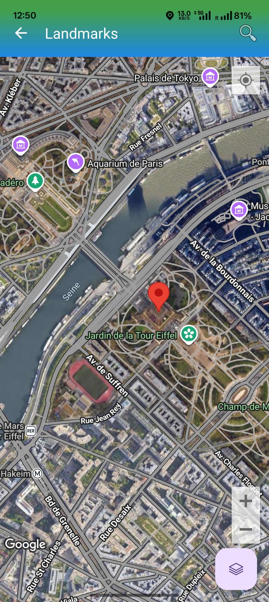
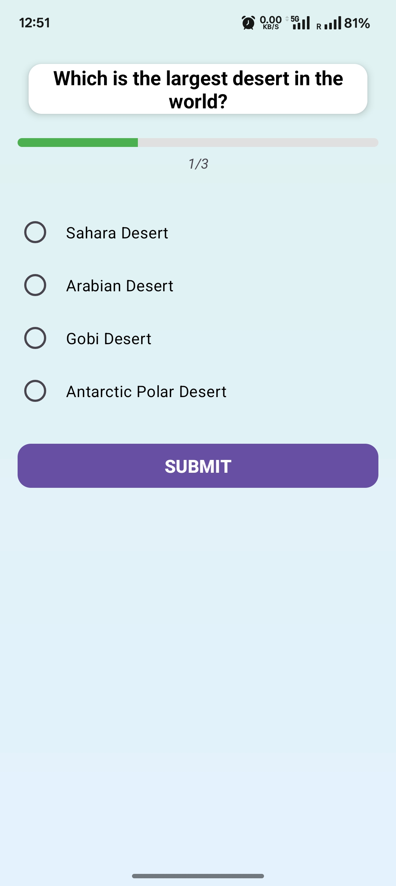
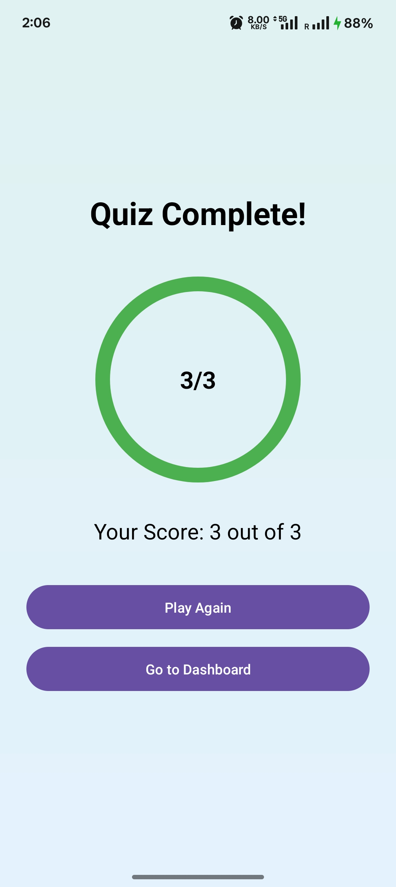

# 🌍 GeoAI Smart Explorer (Geography Explorer)

An interactive Android application built with Kotlin that helps users explore geographical features using maps, satellite imagery, quizzes, and cloud-based score tracking.

The app demonstrates modern Android development concepts such as **Firebase cloud integration, Canvas graphics, animations, and Google Maps APIs**.

---

# 🚀 Features

### 🔐 Secure Authentication

* Firebase Authentication (Email Login & Signup)
* User session management

### 🔒 Biometric App Lock

* Fingerprint / Face ID authentication
* Toggle option to enable or disable app lock

### 🗺️ Interactive Maps

* Google Maps SDK integration
* Explore categories like:

    * Continents
    * Oceans
    * Mountains
    * Deserts
    * Rivers
    * Landmarks
    * Volcanoes
    * Lakes
    * Islands
    * Forests
* Hybrid / Terrain / Normal map views
* Location search using Geocoder
* User location support

### 🧠 Geography Quiz System

* Multiple choice geography questions
* Instant answer feedback
* Animated circular result progress
* Interactive quiz experience

### ☁ Cloud Score Storage

* Firebase Realtime Database
* Quiz scores stored in the cloud
* High score displayed on dashboard
* Complete quiz score history

### 🎨 Graphics & Animations

* Canvas-based **rotating Earth visualization**
* Splash screen animations
* Dashboard card click animations
* Animated quiz result progress indicator

### 📱 Modern UI

* Material Design components
* Smooth animations
* Responsive layouts

---

# 🛠 Technologies Used

* **Kotlin**
* **Android Studio**
* **Firebase Authentication**
* **Firebase Realtime Database**
* **Google Maps SDK**
* **Android Canvas API**
* **Material Design Components**
* **ViewBinding**

---

# 📂 Project Architecture

```text
GeoAI-Smart-Explorer
 ├── FirebaseScoreManager
 ├── EarthCanvasView (Canvas animation)
 ├── Activities
 │    ├── SplashActivity
 │    ├── LoginActivity
 │    ├── SignUpActivity
 │    ├── MainActivity
 │    ├── QuizActivity
 │    ├── ResultActivity
 │    ├── ScoreHistoryActivity
 │    ├── CategoryListActivity
 │    └── DetailActivity
```

---

# 📸 Screenshots

|                  Splash Screen                 |                  Login Screen                 |                 Sign Up Screen                 |
| :--------------------------------------------: | :-------------------------------------------: | :--------------------------------------------: |
|  |  |  |

|                     Dashboard                      |                    Category List                   |                Interactive Map               |
|:--------------------------------------------------:| :------------------------------------------------: | :------------------------------------------: |
|  |  |  |

|               Quiz in Progress               |                   Quiz Result                  |                 Score History                 |
| :------------------------------------------: | :--------------------------------------------: | :-------------------------------------------: |
|  |  |  |

